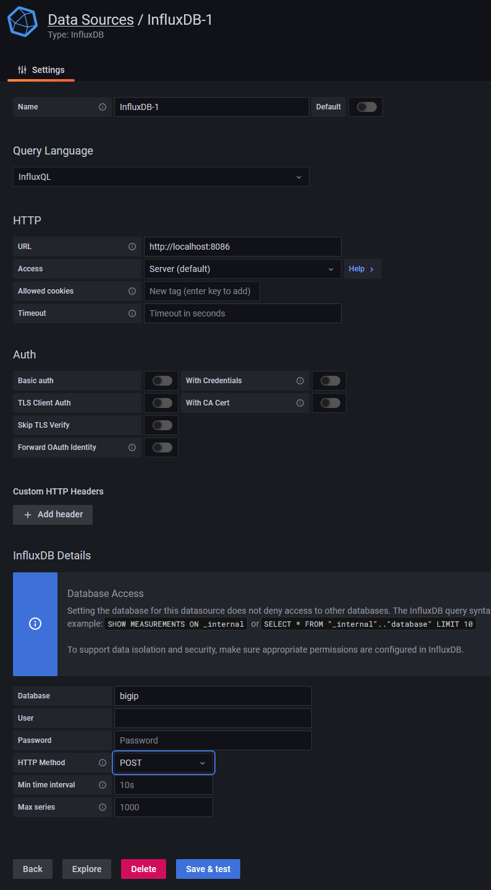
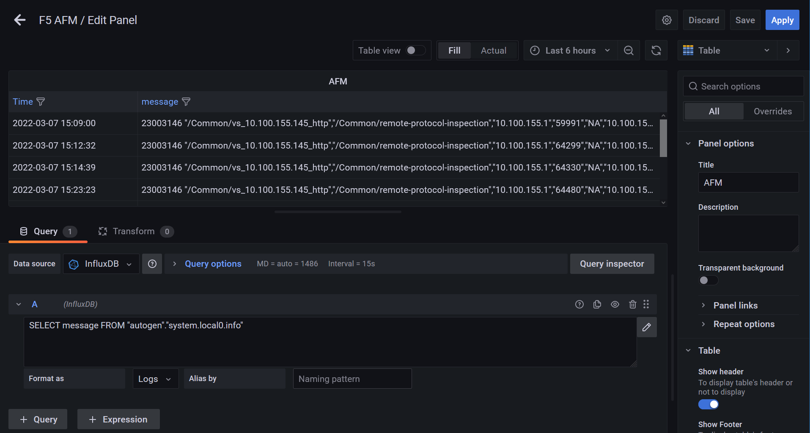

# Send F5 Syslog Data to InfluxDB

This article shows how to collect syslog data into InfluxDB using Fluentd and build a Grafana dashboard

## Preface

Versions:
* Debian 11 bullseye
* Grafana 8.4.3
* InfluxDB 1.8.10
* Fluentd (td-agent) 4.3.0
* fluent-plugin-influxdb 2.0.0

## Install prerequisites
```shell
root@grafana:~# apt install gnupg apt-transport-https software-properties-common wget
```

## Step 1: Install Grafana OSS release
Official Grafana Guide: [Install Grafana on Debian or Ubuntu](https://grafana.com/docs/grafana/labigip/installation/debian/)
```shell
root@grafana:~# echo "deb https://packages.grafana.com/oss/deb stable main" | tee -a /etc/apt/sources.list.d/grafana.list
root@grafana:~# wget -q -O - https://packages.grafana.com/gpg.key | apt-key add -
root@grafana:~# apt update
root@grafana:~# apt install grafana
```

## Step 1: Install InfluxDB 1.x Open Source and Chronograf

### Install InfluxDB 1.x Open Source
```shell
root@grafana:~# wget https://dl.influxdata.com/influxdb/releases/influxdb_1.8.10_amd64.deb
root@grafana:~# dpkg -i influxdb_1.8.10_amd64.deb
```

### Install Chronograf time series data visualization
Current installation instructions: [InfluxDB 1.x Open Source](https://portal.influxdata.com/downloads/0)
```shell
root@grafana:~# wget https://dl.influxdata.com/chronograf/releases/chronograf_1.9.3_amd64.deb
root@grafana:~# dpkg -i chronograf_1.9.3_amd64.deb
```

## Step 2: Install Fluentd and the InfluxDB plugin

### Configure Fluentd prerequisites
Please follow the [Pre-installation Guide](https://docs.fluentd.org/installation/before-install) to configure your OS properly.

### Install Fluentd (also called td-agent)
Official Fluentd Guide: [How to install stable versions of td-agent deb packages](https://docs.fluentd.org/installation/install-by-deb)
```shell
root@grafana:~# curl -fsSL https://toolbelt.treasuredata.com/sh/install-debian-bullseye-td-agent4.sh | sh
```

### Install InfluxDB output plugin for Fluentd
```shell
td-agent-gem install fluent-plugin-influxdb
```

##  Step 3: Create database
Create a database called bigip. This is where we will be storing syslog data:
```shell
root@grafana:~# curl -i -X POST http://localhost:8086/query --data-urlencode "q=CREATE DATABASE bigip"
HTTP/1.1 200 OK
Content-Type: application/json
Request-Id: 50b35659-9e1b-11ec-8003-000c29b101f7
X-Influxdb-Build: OSS
X-Influxdb-Version: 1.8.10
X-Request-Id: 50b35659-9e1b-11ec-8003-000c29b101f7
Date: Mon, 07 Mar 2022 13:34:29 GMT
Transfer-Encoding: chunked

{"results":[{"statement_id":0}]}
```

Verify the database was created successfully:
```shell
root@grafana:~# curl "http://localhost:8086/query?q=show+databases"
{"results":[{"statement_id":0,"series":[{"name":"databases","columns":["name"],"values":[["_internal"],["bigip"]]}]}]}
```

## Step 4: Configure /etc/td-agent/td-agent.conf
Configure /etc/td-agent/td-agent.conf as follows:
```text
<source>
  @type syslog
  port 42185
  tag system
</source>

<match system.*.*>
  @type influxdb
  dbname bigip
  flush_interval 10s # for testing
  host YOUR_INFLUXDB_HOST # default: localhost
  port YOUR_INFLUXDB_PORT # default: 8086
</match>
```

Your syslog data should be flowing into InfluxDB every 10 seconds (this is configured by flush_interval).

## Step 5: Configure remote logging on F5

### fluentd pool
```text
ltm pool pl_fluentd {
    members {
        10.100.153.48:42185 {
            address 10.100.153.48
            session monitor-enabled
            state down
        }
    }
    monitor gateway_icmp
}
```

### Log Destination
```text
sys log-config destination remote-high-speed-log log_dest_hsl {
    pool-name pl_fluentd
    protocol udp
}
sys log-config destination remote-syslog log_dest_fluentd {
    remote-high-speed-log log_dest_hsl
}
```

### Log Publisher
```text
sys log-config publisher remote_fluentd_publisher {
    destinations {
        log_dest_fluentd { }
    }
}
```

### AFM Log Profile
```text
security log profile remote-protocol-inspection {
    protocol-dns {
        remote-protocol-inspection { }
    }
    protocol-sip {
        remote-protocol-inspection { }
    }
    protocol-transfer {
        remote-protocol-inspection {
            publisher remote_fluentd_publisher
        }
    }
    ssh-proxy {
        remote-protocol-inspection { }
    }
}
```

## Step 6: Confirm data is flowing in
Verify with tcpdump on BIG-IP that the data is sent correctly to flunetd.
```bash
[root@afm:Active:Standalone] config # tcpdump -nni 0.0 port 42185 -X
```

Check with the Influx CLI that the data is in the database.
Start by logging into the Influx CLI:
```shell
root@grafana:~# influx
Connected to http://localhost:8086 version 1.8.10
InfluxDB shell version: 1.8.10
```

Next, set the __bigip__ database to be used for all future requests.
```shell
> use bigip
Using database bigip
```

Do a SELECT on data in this database. Fluentd's tag is generated by the tag parameter (tag prefix), facility level, and priority.
```shell
> SELECT message FROM "autogen"."system.local0.info"
name: system.local0.info
time                message
----                -------
1646662140000000000 23003146 "/Common/vs_10.100.155.145_http","/Common/remote-protocol-inspection","10.100.155.1","59991","NA","10.100.155.145","80","0","HTTP","/favicon.ico","GET /favicon.ico HTTP/1.1\r\nHost: 10.100.155.145\r\nUser-Agent: Mozilla/5.0 (Windows NT 10.0; Win64; x64; rv:97.0) Gecko/20100101 Firefox/97.0\r\nAccept: image/avif,image/webp,*/*\r\nAccept-Language: en-US,en;q=0.5\r\nAccept-Encoding: gzip, deflate\r\nDNT: 1\r\nConnection: keep-alive\r\nReferer: http://10.100.155.145/\r\n\r\n","Mar 07 2022 15:09:00","HTTP protocol compliance failed","14111326559714855302","Host header contains IP address","BLOCK","F5","PSM","pgo_use x86_64 vadc TMM Version 16.1.2.1.0.0.10 ","afm.zerotrust.works","192.168.100.235","5","23003146"
```

## Step 7: Create Grafana dashboards
Login to Grafana __http://localhost:3000__ with admin/admin.

### Add data source
Go to __Configuration__ >> __Data Scources__, choose __Add data source__ and select __InfluxDB__, set your credentials and select __HTTP Method__ to be __POST__.



### Add Dashboard
Go to __Dashboards__ >> __Browse__, choose __New Dashboard__.
Create a dashboard of the type table with the following query:
`SELECT message FROM "autogen"."system.local0.info"`



## Closing thoughts
* The dashboard is not very useful, all relevant data is in the __message__ column. If possible this should be separated by the comma character into multiple columns. 
* Installing the Chronograf tool was not needed. At least for this project. It actually caused a port conflict with a fluentd listener on port 8888.
* For adding more security, a dedictated DB User can be created in the Influx CLI: `CREATE USER influx-user WITH PASSWORD 'P@$$w0rd' WITH ALL PRIVILEGES`. Probably also via cURL: `curl -i -X POST http://localhost:8086/query --data-urlencode "q=CREATE USER influx-user WITH PASSWORD 'P@$$w0rd' WITH ALL PRIVILEGES"`.

## Further reading
* [Send Syslog Data to InfluxDB](https://docs.fluentd.org/how-to-guides/syslog-influxdb )
* [Fluent syslog input plugin config](https://docs.fluentd.org/input/syslog)
* [Data exploration using InfluxQL](https://docs.influxdata.com/influxdb/v1.6/query_language/data_exploration/)