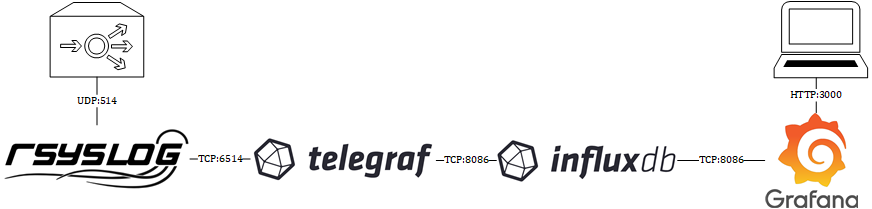
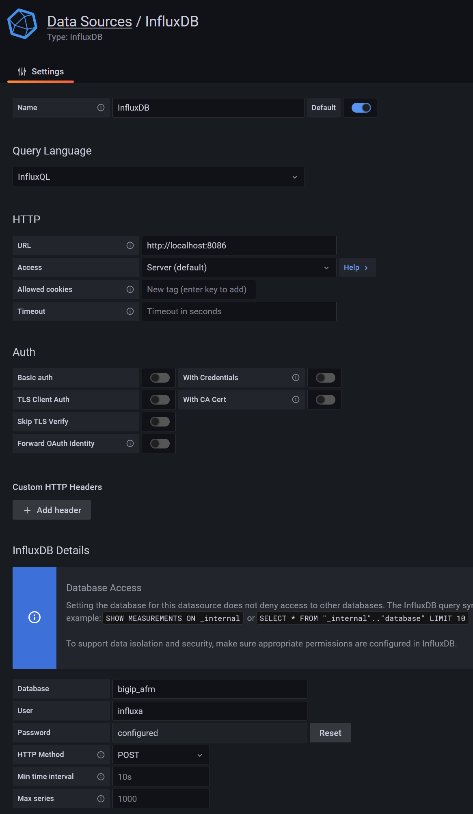
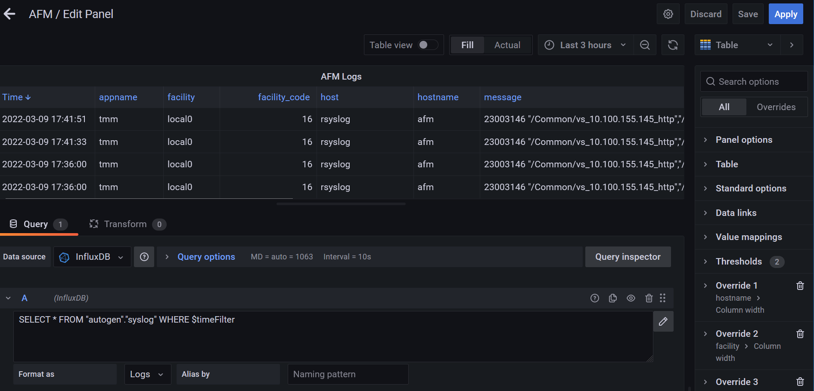

# Send F5 Syslog Data to Telegraf

This guide shows how to collect syslog data from BIG-IP AFM into InfluxDB using telegraf and build a Grafana dashboard

## Preface

### Installed versions
* Debian 11 bullseye
* rsyslog 8.2102.0-2
* Grafana 8.4.3
* InfluxDB 1.6.7~rc0-1+b5
* telegraf 1.21.4-1

This guide presumes that you check and enable all services with
```shell
root@rsyslog:~# systemctl enable influxdb.service
root@rsyslog:~# systemctl start influxdb.service
```

### Diagram


## Install prerequisites
```shell
root@rsyslog:~# apt install curl apt-transport-https software-properties-common wget gnupg
```

## Step 1: Install Grafana OSS release
Grafana will be used to visiualize the syslog events.
Official Grafana installation guide: [Install Grafana on Debian or Ubuntu](https://grafana.com/docs/grafana/labigip/installation/debian/)
```shell
root@rsyslog:~# echo "deb https://packages.grafana.com/oss/deb stable main" | tee -a /etc/apt/sources.list.d/grafana.list
root@rsyslog:~# wget -q -O - https://packages.grafana.com/gpg.key | apt-key add -
root@rsyslog:~# apt update
root@rsyslog:~# apt install grafana
```

## Step 2: Install InfluxDB 1.x Open Source

### Install InfluxDB 1.x Open Source
InfluxDB is a time-series databases. The syslog messages will be stored in InfluxDB and visiualized in Grafana.
Current installation instructions: [InfluxDB 1.x Open Source](https://portal.influxdata.com/downloads/0)
```shell
root@rsyslog:~# wget https://dl.influxdata.com/influxdb/releases/influxdb_1.8.10_amd64.deb
root@rsyslog:~# dpkg -i influxdb_1.8.10_amd64.deb
```
### Configure InfluxDB
Enable the HTTP endpoint by uncommenting the following four lines in __/etc/influxdb/influxdb.conf__.

```text
[http]
  # Determines whether HTTP endpoint is enabled.
    enabled = true

  # The bind address used by the HTTP service.
    bind-address = ":8086"

  # Determines whether user authentication is enabled over HTTP/HTTPS.
    auth-enabled = false

  # The default realm sent back when issuing a basic auth challenge.
  # realm = "InfluxDB"

  # Determines whether HTTP request logging is enabled.
    log-enabled = true
```

### Add InfluxDB user with administrative permissions and create a database
Add a dedictated db user in the Influx CLI:
```shell
root@rsyslog:~# influx
> CREATE USER <<yourusername>> WITH PASSWORD <<yourpassword>> WITH ALL PRIVILEGES
> CREATE DATABASE <<yourdatabasename>>
> exit
```

### Restart InfluxDB to apply the changes
```shell
root@rsyslog:~# systemctl restart influxdb.service
```

## Step 3: Install Telegraf
Telegraf is used for collecting the log messages from rsyslog.

### Install Telegraf
Current installation instructions: [InfluxDB 1.x Open Source](https://portal.influxdata.com/downloads/0)
```shell
root@rsyslog:~# wget https://dl.influxdata.com/telegraf/releases/telegraf_1.21.4-1_amd64.deb
root@rsyslog:~# sudo dpkg -i telegraf_1.21.4-1_amd64.deb
```

### Configure Telegraf 
Modify /etc/telegraf/telegraf.conf with the following configurations
For sending the output data to InfluxDB add:
```text
[[outputs.influxdb]]
  urls = ["http://127.0.0.1:8086"]
  database = <<yourdatabasename>>
  username = <<yourusername>>
  password = <<yourpassword>>
```

And for adding a listening port and receiving data from rsyslog add:
```text
[[inputs.syslog]]
  server = "udp://:6514"
```
### Restart telegraf to apply the changes
```shell
root@rsyslog:~# systemctl restart telegraf.service
```

## Step 4: Configure rsyslog

### Configure /etc/rsyslog.conf
Uncomment the following lines in order to enable receiving rsyslog data on port 514/UDP.
```text
# provides UDP syslog reception
module(load="imudp")
input(type="imudp" port="514")
```

For  dynamic file name generation also add the following.
```text
$template remote-incoming-logs,"/var/log/%HOSTNAME%/%PROGRAMNAME%.log"
*.* ?remote-incoming-logs
```

### Configure /etc/rsyslog.d/50-telegraf.conf
Create a file called /etc/rsyslog.d/50-telegraf.conf and add the following.
```text
# use asynchronous processing
$ActionQueueType LinkedList
# set file name, also enables disk mode
$ActionQueueFileName srvrfwd
# infinite retries on insert failure
$ActionResumeRetryCount -1
# save in-memory data if rsyslog shuts down
$ActionQueueSaveOnShutdown on

# Forward to telegraf using udp according to RFC 5424 (if hostname contains "afm")
:hostname, contains, "afm"
*.* @127.0.0.1:6514;RSYSLOG_SyslogProtocol23Format
```

### Restart syslog to apply the changes
```shell
root@rsyslog:~# systemctl restart rsyslog.service
```

## Step 5: Configure remote logging on F5

### rsyslog pool
```text
ltm pool pl_rsyslog {
    members {
        10.100.153.51:514 {
            address 10.100.153.51
            session monitor-enabled
            state up
        }
    }
    monitor gateway_icmp
}
```

### Log Destination
```text
sys log-config destination remote-high-speed-log log_dest_hsl {
    pool-name pl_rsyslog
    protocol udp
}
sys log-config destination remote-syslog log_dest_rsyslog {
    remote-high-speed-log log_dest_hsl
}
```

### Log Publisher
```text
sys log-config publisher remote_rsyslog_publisher {
    destinations {
        log_dest_rsyslog { }
    }
}
```

### AFM Log Profile
```text
security log profile remote-protocol-inspection {
    protocol-dns {
        remote-protocol-inspection { }
    }
    protocol-sip {
        remote-protocol-inspection { }
    }
    protocol-transfer {
        remote-protocol-inspection {
            publisher remote_rsyslog_publisher
        }
    }
    ssh-proxy {
        remote-protocol-inspection { }
    }
}
```

## Step 6: Confirm data is flowing in

Check with the Influx CLI that the data is in the database.
Start by logging into the Influx CLI:
```shell
root@grafana:~# influx
Connected to http://localhost:8086 version 1.8.10
InfluxDB shell version: 1.8.10
```

Next, set the __bigip_afm__ database to be used for all future requests.
```shell
> show databases
name: databases
name
----
_internal
telegraf
bigip_afm
> use bigip_afm
Using database bigip_afm
```

The measurement acts as a container for tags, fields, and the time column, and the measurement name is the description of the data that are stored in the associated fields. Use the command __show measurements__ to find the syslog data.
Do a SELECT * on the data in this measurement. You should retrieve some entries.
```shell
> show measurements
name: measurements
name
----
cpu
disk
diskio
kernel
mem
processes
swap
syslog
system
> SELECT * FROM "autogen"."syslog"
```

## Step 7: Create Grafana dashboards
Login to Grafana __http://localhost:3000__ with admin/admin.
Change the default admin password.

### Add data source
Go to __Configuration__ >> __Data Scources__, choose __Add data source__ and select __InfluxDB__, set your credentials and select __HTTP Method__ to be __POST__.



### Add Dashboard
Go to __Dashboards__ >> __Browse__, choose __New Dashboard__.
Create a dashboard of the type table with the following query:
`SELECT * FROM "autogen"."syslog" WHERE $timeFilter`



## Closing thoughts

## Further reading
* [Log Server with Rsyslog, Influx, Telegraf and Grafana](https://henrikhain.io/post/raspberry-pi-as-log-server-with-rsyslog-influx-telegraf-and-grafana/)
* [Telegraf / InfluxDB / Grafana as syslog receiver](https://nwmichl.net/2020/03/15/telegraf-influxdb-grafana-as-syslog-receiver/)
* [](https://www.rsyslog.com/doc/v8-stable/configuration/templates.html)